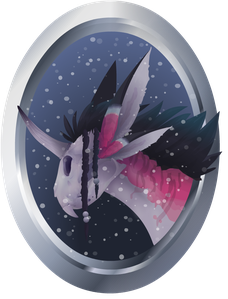

## Dream Coins

Dream Coins is a coin generator and search for prizes game for the website http://www.whirled.com/ and Synced http://www.syncedonline.com/
The launcher game was created for Ghost Fever for her group named "Dream Eaters": http://www.syncedonline.com/#groups-d_543
I was paid 20$ as a free-lance developer to program this game.

## Dependencies
You will need:
- Flex SDK (to build the files) 
  - http://www.adobe.com/devnet/flex/flex-sdk-download.html
- Adobe Flash or Notepad++ (to edit the Blackvoid actionscript codes) 
  - https://notepad-plus-plus.org/download/v7.2.2.html
  - http://www.adobe.com/products/animate.html

## Documentation and Setup
- Place the Dream Coins folder (with the files inside the folder) into your whirled-sdk or synced-sdk home directory
- Now open the build.bat file
- If you have not setup your Flex sdk to AVRG games in Whirled or Synced before, it will ask you to locate your flex sdk and the runtime
- Once you have setup your runtime and flexsdk file directories in the build.bat, exit the build.bat file and then re-open it
- It should build the swf and abc files and is now ready to be uploaded to Whirled or Synced
